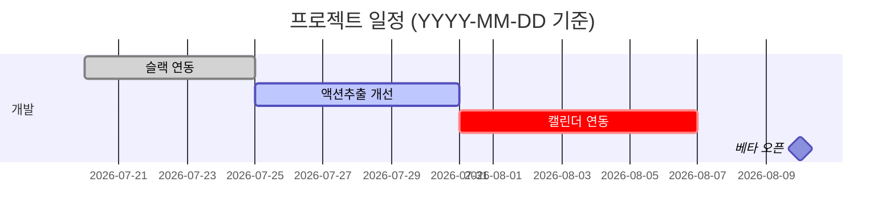

> **작업 흐름(항상):** 기존 컨텍스트(자료·채널·채팅) 점검 + 리서치 → 기획 → 시각화 → 스킬 호출/실행. 자세히 [[method]].

# gantt — 살아있는 간트 / WBS

한 번 그리고 끝나는 그림이 아니다. **부를 때마다 현황을 다시 읽어 갱신해 그린다.**

## 공통 원칙
근거(실제 태스크·활동)로만 그린다. 없으면 지어내지 말고 "확인 필요". 반자동(초안→사람 검토). 일정 판단엔 "왜"를 한 줄.

## 1. 현황 긁어오기 (갱신 근거)
- 태스크·마감·의존·완료: [[project]] — `python3 "$CLAUDE_PLUGIN_ROOT/scripts/project.py" --list` / `--status`
- **팀원 한 일(진행률 추적)**: [[team-standup]] 또는 커넥터(Jira/Slack/Notion). 팀원이 실제로 끝낸 것을 보고 진행률·지연을 갱신한다.
- 단계·마일스톤: [[roadmap]] · [[sprint-plan]].

## 2. 그리기 (mermaid 간트 — 자체 렌더)
````

````
- `done`(완료)·`active`(진행)·`crit`(지연/위험), `after`(의존), `milestone`(마일스톤)로 상태를 색·구조에 담는다. 규모가 크면 자체 완결 HTML 간트로.

## 3. 살아있는 갱신 (핵심)
- 부를 때마다 `project.py --status` + 팀원 한 일을 다시 반영해 **완료·진행률·지연을 최신화**한다.
- 지연(마감 지남)·블로커는 `crit`으로 눈에 띄게 + "왜 밀렸나 + 만회안" 한 줄.
- 단일 진실원은 [[project]](project.md). 간트는 그 뷰일 뿐 — 변경은 project에 반영하고 여기서 다시 그린다.

## 체이닝
[[meeting]] 액션 → [[project]] 등록 → 여기서 간트 갱신. [[sprint-plan]]·[[roadmap]]와 연계.
